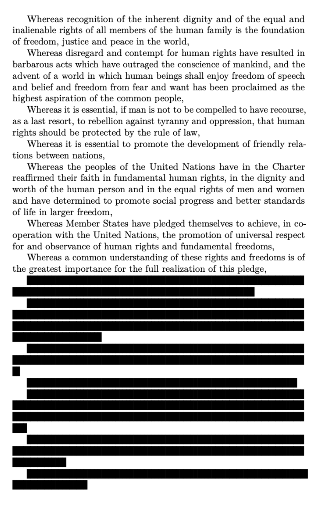

# luacensor
## About
A very lightweight `LaTeX` package for censoring sensitive information using `LuaLaTeX` to redact the text, and the typeface ‘Flow Block’ to create suitable black lines.  This approach to censorship is more accessibility friendly than simply turning censored text into an unreadable image, since a screen reader will indicate the censored text.  It also has an advantage over highlighting based censorship (such as in acrobat), in that the `Lua` code randomly changes the length of strings, such that on average censored text is the same length, but any individual string may be a different length.  Thus, the exact length of a censored string is not a guide to the number of letters in the original string.  This matters for preventing ‘jigsaw identification’, by which the otherwise meaningless information of the length of say, a redacted surname, could be used to narrow down the possible identity of someone when there were several possible candidates with differing names.    The package is also quite lightweight, since the generation of the obfuscation takes little code, and the generation of the black marker effect is left to Flow Block.  Users without the free Flow Block typeface installed (available in this repo or on Google Fonts) will instead see a nice fallback solution using the default `TeX` distribution typeface Source Sans Pro and the unicode glyph ‘▬’.  Credit is given in the source code to the helpful Tex.SE users who aided with this package's development.

## Usage

The main command for the package is:
`\cnsr{}`, which will censor athe argument of the macro where the document contains the statement `\cnsrtrue`.  This global switch allows users to easily change between documents without redaction (for example, for the eyes of judicial authorities), and documents with redaction (for public consumption).  There are no other settings.

## Requirements
`LuaLaTeX` and and a working `TeX` distribution.

## Sample

## Licence
This projected is licensed under the LPPL.
